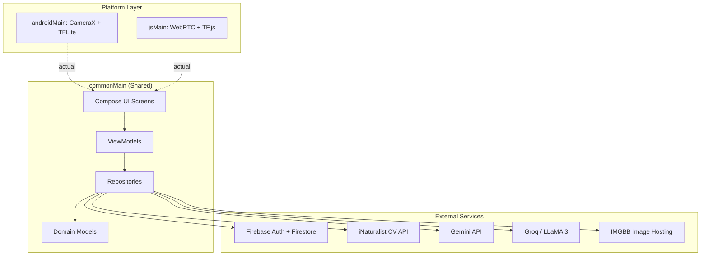
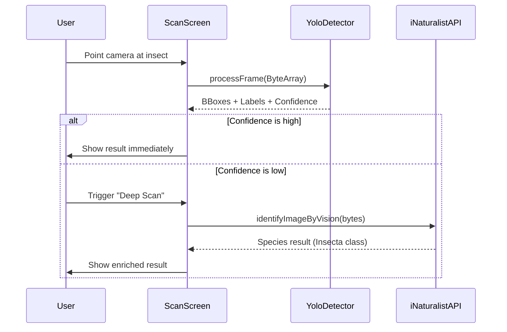

# 🐛 BugScanner


BugScanner is a full-stack, multiplatform insect detection and classification ecosystem built with **Kotlin Multiplatform (KMP)** and **Compose Multiplatform**. It goes beyond a simple identification tool — it combines on-device edge AI inference, cloud-based fallback identification, an LLM-powered chatbot, a self-expanding Firestore encyclopedia, and a **comprehensive Admin Dashboard** into a single, unified application for **Android** and **Web**.

## 🔗 Access & Downloads

* **Web app:** [https://bugscanner-2026.web.app](https://bugscanner-2026.web.app)
* **Android APK release:** [BugScanner Releases](https://github.com/iAmHieu2012/bug-scanner/releases)

*Note: The Android package is distributed through GitHub Releases via an automated CI/CD pipeline. Android may ask you to allow installation from unknown sources before installing.*

## ⚙️ How It Works

BugScanner uses a **Hybrid Detection Engine** with two tiers to ensure speed, offline capability, and high accuracy:

1. **On-Device Inference (YOLO11s):** A quantized YOLO11s model runs locally on the device CPU/GPU via TensorFlow Lite (Android) or TensorFlow.js (Web). This provides real-time bounding box detection and species classification with near-zero latency, requiring no network connection.
2. **Cloud Fallback (iNaturalist API):** When the local model's confidence is low or the species falls outside its training set, the app automatically escalates the image to the iNaturalist Computer Vision API — a database of over 100,000 species — for deep analysis.

## ✨ Key Features

* **📷 Real-Time Camera Detection:** Live YOLO inference on the camera feed with freeze-frame capture for high-confidence results.
* **📁 Gallery Image Scanning:** Single-pass inference on static images picked from device storage.
* **☁️ Cloud Fallback Identification:** Automatic escalation to the iNaturalist CV API when local confidence is insufficient.
* **📚 Dynamic Insect Encyclopedia:** A Firestore-backed database that auto-expands. New species discovered by users are written back automatically. Fully cached for offline support.
* **🔍 Hybrid Intelligent Search:** The Encyclopedia features a 3-tier smart search engine:
  1. Instant local database (Firebase) lookup.
  2. Direct high-speed Scientific Name search via iNaturalist API.
  3. AI-powered translation fallback (Groq LLaMA-3) for Vietnamese common names.
  *Includes a toggle to force strict Scientific Name searches.*
* **💬 BugScanner AI Chatbot:** Context-aware assistant powered by Google Gemini and Groq (LLaMA 3), with biological data pre-injected into the system prompt.
* **📊 Scan History:** Persistent scan records with lightweight cloud image hosting via IMGBB.
* **🔐 Secure Authentication:** User login and account management handled seamlessly via Firebase Authentication.
* **📱 Adaptive UI & Native Sharing:** Automatically switches between Bottom Navigation Bar (mobile) and Navigation Rail (desktop/web). Implements native sharing via Intents (Android) and Web Share API (Web).
* **🛡️ Secure Admin Dashboard:** A dedicated role-based control panel for administrators to:
  * View system-wide analytics (Total Users, Total Scans, Top Insects).
  * Manage Users (View profiles, ban/unban users).
  * Edit the Encyclopedia (Add, edit, or delete insect records).
  * Dynamically configure AI Models and Prompts (Gemini & Groq) in real-time via Firestore `app_config`.

## 🛠️ Tech Stack

| Component | Technology |
| ----------- | ------------ |
| **Language** | Kotlin 2.x |
| **UI Framework** | Jetpack Compose Multiplatform |
| **Architecture** | MVVM + Clean Architecture + Repository pattern |
| **Dependency Injection** | Koin |
| **Navigation** | Voyager |
| **ML (Android)** | TensorFlow Lite with GPU delegate (YOLO11s) |
| **ML (Web)** | TensorFlow.js via Kotlin/JS bridge |
| **AI Chatbot** | Google Gemini API (`gemini-1.5-flash`) + Groq (LLaMA 3) |
| **External APIs** | iNaturalist Computer Vision API, IMGBB API |
| **Backend & Auth** | Firebase Firestore, Firebase Authentication |
| **Camera** | AndroidX CameraX (`ImageAnalysis`) / WebRTC `getUserMedia` |
| **Build System** | Gradle with Kotlin DSL + Version Catalogs |

## 📐 Architecture Overview

BugScanner follows a strict **MVVM (Model-View-ViewModel)** pattern with a clean separation between shared business logic and platform-specific implementations using KMP's `expect`/`actual` mechanism.



### Detection Flow



---

## 📁 Project Structure

```text
bug-scanner/
├── src/
│   ├── composeApp/                     # Main Compose Multiplatform module
│   │   ├── src/
│   │   │   ├── commonMain/             # Shared code (UI, Domain, Repos, ViewModels)
│   │   │   ├── androidMain/            # Android implementations (CameraX, TFLite)
│   │   │   │   └── assets/             # Place model.tflite here
│   │   │   ├── webMain/                # Web implementations (TF.js, WebRTC)
│   │   │   └── jsMain/                 # Kotlin/JS bridge and web polyfills
│   │   ├── build.gradle.kts            # App-level build configuration
│   │   └── google-services.json        # Firebase configuration (Android)
│   ├── gradle/                         # Gradle wrapper & Version Catalog
│   └── settings.gradle.kts
├── .github/workflows/                  # CI/CD pipelines (Build, Release, Deploy)
├── docs/                               # Extended technical documentation
└── README.md
```

## 📋 Prerequisites

* **JDK 17** or higher
* **Android Studio** (Koala or newer) with Kotlin Multiplatform plugin installed
* **Node.js** (Required for the Kotlin/JS web target)
* **Modern Web Browser** (Chrome, Firefox, Safari, Edge)

## 🚀 Getting Started

### 1. Clone the Repository

```bash
git clone <repository-url>
cd bug-scanner/src

```

### 2. Configure API Keys

Create a `local.properties` file in the `src/` directory. These are injected at compile time via the BuildConfig plugin. *(Note: In CI/CD, these are injected automatically via GitHub Secrets).*

```properties
GEMINI_API_KEY=your_gemini_api_key
GROQ_API_KEY=your_groq_api_key
IMGBB_API_KEY=your_imgbb_api_key
INATURALIST_API_TOKEN=your_inaturalist_jwt_token

```

### 3. Place Required Assets

Ensure the following files are placed in their respective directories before building:

* `composeApp/google-services.json` *(Firebase config for Android)*
* `composeApp/src/androidMain/assets/model.tflite` *(YOLO11s quantized model)*
* `composeApp/src/webMain/resources/firebase-config.json` *(Firebase config for Web)*

### 4. Build & Run

#### ▶️ Android

```bash
# Build debug APK
./gradlew :composeApp:assembleDebug

# Install directly to a connected device or emulator
./gradlew :composeApp:installDebug

```

#### 🌐 Web

```bash
# Start hot-reloading development server
./gradlew :composeApp:jsBrowserDevelopmentRun
# Open browser at: http://localhost:8080

# Build for production
./gradlew :composeApp:jsBrowserDistribution

```

## 💻 Development Guide

Adding a new feature involves standard MVVM/Clean Architecture steps:

1. **Domain:** Define the model in `commonMain/domain/model/`.
2. **Data:** Create or update a repository in `commonMain/data/repository/`.
3. **Presentation:** Build a ViewModel in `commonMain/ui/<feature>/` and design the UI components.
4. **Platform-Specifics:** Use `expect`/`actual` for features requiring native APIs (e.g., file pickers, sensors).

## ⚠️ Known Limitations & Bugs

| Area | Issue / Limitation |
| --- | --- |
| **Thermal Throttling (Android)** | Continuous YOLO inference on mobile hardware can cause CPU/GPU heat buildup, triggering OS-level throttling and FPS drops. |
| **App Bundle Size** | Bundling the YOLO11s `.tflite` model in `assets/` for offline use significantly increases the base APK size. |
| **IMGBB Bottleneck** | Cloud AI flows require successful IMGBB image uploads. Slow networks can create visible delays. |
| **Web Single-Thread** | The JS target runs on a single thread; processing high-res image byte arrays can temporarily block the UI. |
| **Cold-Start Offline** | If the app has never been launched with a network connection, the Firestore cache will be empty and the encyclopedia will not load offline. |
| **Android Share Intent Bug** | Meta apps (like Messenger) silently discard text when sharing an image + text together. *Workaround implemented: Fallback to sharing the image URL as text and copying text to the clipboard.* |

## 🔄 CI/CD & Automation

GitHub Actions are configured in `.github/workflows/` to handle a complete multiplatform pipeline:

* **Automated Releases (`release.yml`):** Triggers automatically when a new tag (e.g., `v1.0.0`) is pushed. It builds the Android Release APK, signs it using Keystore Secrets, and publishes it directly to GitHub Releases. API keys are safely injected via GitHub Secrets without needing `local.properties`.
* **Debug Builds (`android-build.yml`):** Automatically compiles a debug `.apk` artifact on every push to the main branch for continuous testing.
* **Firebase Hosting Deployment:** Automatic Kotlin/JS builds and staging/production deployments for Web.
* **iNaturalist Token Rotation:** A scheduled `cron` job running a Python script to automatically fetch and update the JWT token in GitHub Secrets before expiration.

## 📚 Resources

* [Kotlin Multiplatform](https://www.jetbrains.com/help/kotlin-multiplatform-dev/)
* [Compose Multiplatform](https://github.com/JetBrains/compose-multiplatform)
* [TensorFlow Lite](https://www.tensorflow.org/lite) | [TensorFlow.js](https://www.tensorflow.org/js)
* [Ultralytics YOLO](https://docs.ultralytics.com/)
* [Firebase Documentation](https://firebase.google.com/docs)
* [iNaturalist API](https://api.inaturalist.org/v1/docs/)

## 📄 License & 🎓 Credits

Licensed under the [Apache License 2.0](LICENSE).

Developed at **HCMUS** (Ho Chi Minh City University of Science).

*For questions, issues, or contributions, please open an issue or submit a pull request.*
