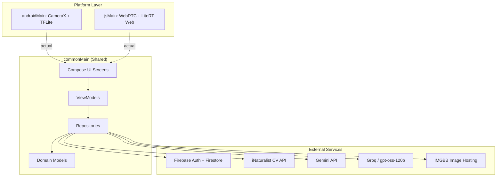

# 🐛 BugScanner

*Read this in other languages: [English](README.md) | [Tiếng Việt](README_vi.md)*


BugScanner is a full-stack, multiplatform insect detection and agricultural ecosystem built with **Kotlin Multiplatform (KMP)** and **Compose Multiplatform**. It goes far beyond a simple identification tool — it introduces a production-ready architecture combining **on-device Edge AI**, **Cloud Fallback**, **Offline-First Data Synchronization**, and a **self-expanding LLM-powered Encyclopedia**.

## 🔗 Access & Downloads

* **Web app:** [https://bugscanner-2026.web.app](https://bugscanner-2026.web.app)
* **Android APK release:** [BugScanner Releases](https://github.com/iAmHieu2012/bug-scanner/releases)

*Note: The Android package is distributed through GitHub Releases via an automated CI/CD pipeline. Android may ask you to allow installation from unknown sources before installing.*

## ⚙️ Hybrid Detection Engine

BugScanner utilizes a two-tier detection architecture to guarantee high accuracy without compromising real-time performance or offline availability:

1. **On-Device Inference (YOLO11s):** A quantized YOLO11s model runs completely locally via TensorFlow Lite (Android) and **LiteRT Web (WASM)**. This provides real-time bounding box detection with zero latency and requires strictly no internet connection.
2. **Cloud Fallback (iNaturalist API):** If the local YOLO model yields low confidence or cannot identify a rare species, the app dynamically routes the image to the iNaturalist Computer Vision API (a database of 100,000+ species) for a deep, cloud-based analysis.

## ✨ Highlight Features & Architecture

* **📚 AI-Generated Encyclopedia (Crowdsourcing):** The app autonomously expands its own database! When a new insect is scanned via Cloud Fallback, the app triggers **Groq (`gpt-oss-120b`)** to generate a comprehensive biological article (Treatment, Host Plants, Danger level) and automatically writes it back to Firebase for future users.
* **📊 Offline-First Scan History:** Engineered for remote agricultural areas with unstable internet. Scans are aggressively cached in local storage (`SharedPreferences`/Web Storage) when offline, and automatically synced to the cloud (via Firestore and IMGBB) the moment network connectivity is restored.
* **💬 Context-Aware AI Chatbot (Gemini):** An integrated assistant powered by Google Gemini. It utilizes **RAG (Retrieval-Augmented Generation)** to automatically read the current insect's encyclopedia entry before chatting with you. Web users can paste images directly (`Ctrl+V`) into the chat seamlessly.
* **🔍 Hybrid Intelligent Search:** The Encyclopedia leverages an advanced 3-tier search engine:
  1. Instant local database lookup using a highly optimized Firestore prefix-search trick (`\uf8ff`).
  2. Direct high-speed Scientific Name search via iNaturalist API.
  3. Contextual Translation Fallback: Uses Groq AI to translate Vietnamese common names into English before querying international databases.
* **🛡️ Secure Admin Dashboard:** A dedicated role-based CMS allowing administrators to:
  * View system-wide analytics using **zero-dependency native Canvas charts** (optimized for KMP size and performance).
  * Manage users and ban accounts in real-time.
  * Dynamically configure AI Models and Prompts via Firestore `app_config` (allowing instant model upgrades without app updates).
* **📱 Adaptive UI & State-Driven Routing:** Automatically adapts layouts between Mobile (Bottom Bar) and Tablet/Desktop (Navigation Rail). Features custom state-driven routing without heavy navigation libraries.

## 🛠️ Tech Stack

| Component | Technology |
| ----------- | ------------ |
| **Language** | Kotlin 2.x |
| **UI Framework** | Jetpack Compose Multiplatform |
| **Architecture** | Clean Architecture (Domain/Data/UI) + MVVM |
| **Dependency Injection** | Koin |
| **ML (Android)** | TensorFlow Lite with GPU delegate (YOLO11s) |
| **ML (Web)** | LiteRT Web (TFLite WASM) via Kotlin/JS bridge |
| **AI Engines** | Google Gemini (`gemini-2.5-flash`) + Groq (`gpt-oss-120b`) |
| **Backend & Auth** | Firebase Firestore, Firebase Authentication |
| **Camera** | AndroidX CameraX (`ImageAnalysis`) / WebRTC `getUserMedia` |

## 📐 Architecture Overview

BugScanner strictly adheres to **Clean Architecture** principles, effectively separating shared business logic from platform-specific APIs using KMP's `expect`/`actual` paradigm.



## 📁 Project Structure

```text
bug-scanner/
├── src/
│   ├── composeApp/                     # Main Compose Multiplatform module
│   │   ├── src/
│   │   │   ├── commonMain/             # Shared code (UI, Domain, Repos, ViewModels)
│   │   │   ├── androidMain/            # Android implementations (CameraX, TFLite)
│   │   │   │   └── assets/             # Place model.tflite here
│   │   │   ├── webMain/                # Web implementations (TF.js, WebRTC)
│   │   │   └── jsMain/                 # Kotlin/JS bridge and web polyfills
│   │   ├── build.gradle.kts            # App-level build configuration
│   │   └── google-services.json        # Firebase configuration (Android)
│   ├── gradle/                         # Gradle wrapper & Version Catalog
│   └── settings.gradle.kts
├── .github/workflows/                  # CI/CD pipelines (Build, Release, Deploy)
├── docs/                               # Extended technical documentation
└── README.md
```

## 📋 Prerequisites

* **JDK 17** or higher
* **Android Studio** (Koala or newer) with Kotlin Multiplatform plugin installed
* **Node.js** (Required for the Kotlin/JS web target)
* **Modern Web Browser** (Chrome, Firefox, Safari, Edge)

## 🚀 Getting Started

### 1. Clone the Repository

```bash
git clone <repository-url>
cd bug-scanner/src
```

### 2. Configure API Keys

Create a `local.properties` file in the `src/` directory. These are injected at compile time via the BuildConfig plugin. *(Note: In CI/CD, these are injected automatically via GitHub Secrets).*

```properties
GEMINI_API_KEY=your_gemini_api_key
GROQ_API_KEY=your_groq_api_key
IMGBB_API_KEY=your_imgbb_api_key
INATURALIST_API_TOKEN=your_inaturalist_jwt_token
```

### 3. Place Required Assets

Ensure the following files are placed in their respective directories before building:

* `composeApp/google-services.json` *(Firebase config for Android)*
* `composeApp/src/androidMain/assets/model.tflite` *(YOLO11s quantized model)*
* `composeApp/src/webMain/resources/firebase-config.json` *(Firebase config for Web)*

### 4. Build & Run

#### ▶️ Android

```bash
# Build debug APK
./gradlew :composeApp:assembleDebug

# Install directly to a connected device or emulator
./gradlew :composeApp:installDebug
```

#### 🌐 Web

```bash
# Start hot-reloading development server
./gradlew :composeApp:jsBrowserDevelopmentRun
# Open browser at: http://localhost:8080

# Build for production
./gradlew :composeApp:jsBrowserDistribution
```

## ⚠️ Known Limitations & Bugs

| Area | Issue / Limitation |
| --- | --- |
| **Thermal Throttling (Android)** | Continuous YOLO inference on mobile hardware can cause CPU/GPU heat buildup, triggering OS-level throttling and FPS drops. |
| **App Bundle Size** | Bundling the YOLO11s `.tflite` model in `assets/` for offline use significantly increases the base APK size. |
| **IMGBB Bottleneck** | Cloud AI flows require successful IMGBB image uploads. Slow networks can create visible delays. |
| **Web Single-Thread** | The JS target runs on a single thread; processing high-res image byte arrays can temporarily block the UI. |
| **Cold-Start Offline** | If the app has never been launched with a network connection, the Firestore cache will be empty and the encyclopedia will not load offline. |
| **Android Share Intent Bug** | Meta apps (like Messenger) silently discard text when sharing an image + text together. *Workaround implemented: Fallback to sharing the image URL as text and copying text to the clipboard.* |

## 🔄 CI/CD & Automation

GitHub Actions are configured in `.github/workflows/` to handle a complete multiplatform pipeline:

* **Automated Releases (`release.yml`):** Triggers automatically when a new tag (e.g., `v1.0.0`) is pushed. It builds the Android Release APK, signs it using Keystore Secrets, and publishes it directly to GitHub Releases. API keys are safely injected via GitHub Secrets without needing `local.properties`.
* **Debug Builds (`android-build.yml`):** Automatically compiles a debug `.apk` artifact on every push to the main branch for continuous testing.
* **Firebase Hosting Deployment:** Automatic Kotlin/JS builds and staging/production deployments for Web.
* **iNaturalist Token Rotation:** A scheduled `cron` job running a Python script to automatically fetch and update the JWT token in GitHub Secrets before expiration.

## 📄 License & 🎓 Credits

Licensed under the [Apache License 2.0](LICENSE).

Developed at **HCMUS** (Ho Chi Minh City University of Science).

*For questions, issues, or contributions, please open an issue or submit a pull request.*
