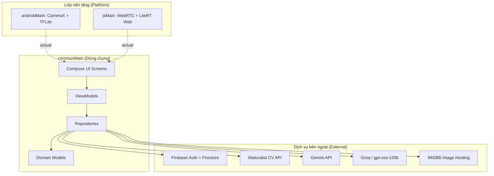

# 🐛 BugScanner

*Đọc bằng ngôn ngữ khác: [English](README.md) | [Tiếng Việt](README_vi.md)*


BugScanner là một ứng dụng Kotlin Multiplatform (KMP) toàn diện dành cho Android và Web. Không chỉ dừng lại ở một công cụ nhận diện thông thường, BugScanner là một hệ sinh thái khép kín: kết hợp giữa nhận diện Edge AI siêu tốc, cơ chế dự phòng trên đám mây (Cloud Fallback), lưu trữ Offline-First và một bách khoa toàn thư tự động học hỏi bằng AI.

## 🔗 Truy cập & Tải xuống

* **Web app:** [https://bugscanner-2026.web.app](https://bugscanner-2026.web.app)
* **Tải APK cho Android:** [BugScanner Releases](https://github.com/iAmHieu2012/bug-scanner/releases)

*Lưu ý: File cài đặt Android được phân phối qua GitHub Releases nhờ hệ thống CI/CD. Hệ điều hành Android có thể sẽ yêu cầu bạn cấp quyền cài đặt ứng dụng từ nguồn không xác định.*

## ⚙️ Cơ chế Nhận diện Lai

BugScanner sử dụng kiến trúc nhận diện hai lớp để đảm bảo độ chính xác cao nhất mà không làm giảm tốc độ thực thi hay khả năng hoạt động khi mất mạng:

1. **Nhận diện tại thiết bị (YOLO11s):** Mô hình YOLO11s lượng tử hóa chạy hoàn toàn trên máy thông qua TensorFlow Lite (Android) và LiteRT Web (WASM). Lớp này cung cấp khả năng phát hiện vật thể theo thời gian thực với độ trễ bằng 0 mà không cần kết nối mạng.
2. **Dự phòng trên đám mây (iNaturalist API):** Nếu mô hình YOLO trả về độ tin cậy thấp hoặc gặp phải loài hiếm, ứng dụng sẽ tự động chuyển tiếp hình ảnh sang API Thị giác Máy tính của iNaturalist để phân tích chuyên sâu.

## ✨ Tính năng Nổi bật & Kiến trúc

* **📚 Bách khoa toàn thư Tự động sinh:** Ứng dụng tự động mở rộng cơ sở dữ liệu! Khi một loài côn trùng mới được nhận diện qua đám mây, hệ thống sẽ gọi Groq AI (`gpt-oss-120b`) để tự động biên soạn một bài viết sinh học chi tiết (Cách xử lý, Mức độ độc hại) và lưu lại trên Firebase.
* **📊 Kiến trúc Offline-First:** Thiết kế đặc thù cho các khu vực sóng yếu. Lịch sử quét được lưu đệm chặt chẽ vào bộ nhớ máy khi mất mạng, và tự động đồng bộ ngầm lên đám mây (Firestore và IMGBB) ngay khi có mạng trở lại.
* **💬 Trợ lý ảo AI theo ngữ cảnh:** Tích hợp Google Gemini kết hợp cơ chế RAG (Retrieval-Augmented Generation). AI sẽ tự động đọc bài viết bách khoa của sinh vật hiện tại trước khi trò chuyện với bạn. Đặc biệt, người dùng Web có thể dán ảnh trực tiếp vào khung chat bằng phím tắt `Ctrl+V`.
* **🔍 Tìm kiếm Thông minh Đa lớp:** Bách khoa toàn thư trang bị bộ máy tìm kiếm 3 lớp:
  1. Tra cứu siêu tốc tại Local Database bằng kỹ thuật tìm kiếm tiền tố (`\uf8ff`) của Firestore.
  2. Tra cứu bằng Tên khoa học trực tiếp qua API iNaturalist.
  3. Dịch thuật theo ngữ cảnh: Sử dụng AI để tự động dịch tên tiếng Việt sang tiếng Anh làm từ khóa dự phòng khi tìm kiếm trên cơ sở dữ liệu quốc tế.
* **🛡️ Trang quản trị phân quyền (Admin Dashboard):** Hệ thống CMS mạnh mẽ cho phép quản trị viên:
  * Xem biểu đồ phân tích bằng kỹ thuật native Canvas không dùng thư viện ngoài (Tối ưu triệt để hiệu năng KMP).
  * Quản lý người dùng, khóa/mở khóa tài khoản theo thời gian thực.
  * Cấu hình động các mô hình AI và prompt trực tiếp trên Firestore (Áp dụng lập tức trên mọi thiết bị mà không cần cập nhật app).
* **📱 Giao diện Tự thích ứng (Adaptive UI):** Tự động chuyển đổi bố cục giữa điện thoại di động (thanh điều hướng dưới) và màn hình lớn (thanh điều hướng cạnh). Hệ thống định tuyến (routing) được tự xây dựng dựa trên state thay vì dùng thư viện cồng kềnh.

## 🛠️ Công nghệ Sử dụng

| Thành phần | Công nghệ |
| ----------- | ------------ |
| **Ngôn ngữ** | Kotlin 2.x |
| **Giao diện (UI)** | Jetpack Compose Multiplatform |
| **Kiến trúc** | Clean Architecture (Domain/Data/UI) + MVVM |
| **Dependency Injection** | Koin |
| **Machine Learning (Android)** | TensorFlow Lite với GPU delegate (YOLO11s) |
| **Machine Learning (Web)** | LiteRT Web (TFLite WASM) kết nối qua Kotlin/JS bridge |
| **Động cơ AI** | Google Gemini (`gemini-2.5-flash`) + Groq (`gpt-oss-120b`) |
| **Backend & Xác thực** | Firebase Firestore, Firebase Authentication |
| **Camera** | AndroidX CameraX (`ImageAnalysis`) / WebRTC `getUserMedia` |

## 📐 Tổng quan Kiến trúc

BugScanner tuân thủ nghiêm ngặt nguyên lý Clean Architecture, phân tách rõ ràng các logic nghiệp vụ dùng chung khỏi các API đặc thù của từng nền tảng thông qua cơ chế `expect`/`actual`.



## 📁 Cấu trúc Dự án

```text
bug-scanner/
├── src/
│   ├── composeApp/                     # Module Jetpack Compose chính
│   │   ├── src/
│   │   │   ├── commonMain/             # Code dùng chung (UI, Domain, Repos, ViewModels)
│   │   │   ├── androidMain/            # Tích hợp Android (CameraX, TFLite)
│   │   │   │   └── assets/             # Chứa file model.tflite
│   │   │   ├── webMain/                # Tích hợp Web (LiteRT, WebRTC)
│   │   │   └── jsMain/                 # Cầu nối Kotlin/JS và web polyfills
│   │   ├── build.gradle.kts            # Cấu hình Gradle cấp độ App
│   │   └── google-services.json        # Cấu hình Firebase (Android)
│   ├── gradle/                         # Gradle wrapper & Version Catalog
│   └── settings.gradle.kts
├── .github/workflows/                  # Luồng CI/CD (Build, Release, Deploy)
├── docs/                               # Tài liệu kỹ thuật chi tiết
└── README.md
```

## 📋 Yêu cầu Hệ thống

* **JDK 17** trở lên.
* **Android Studio** (Bản Koala trở lên) có cài plugin Kotlin Multiplatform.
* **Node.js** (Bắt buộc để build phiên bản Web).
* **Trình duyệt Web hiện đại** (Chrome, Firefox, Safari, Edge).

## 🚀 Hướng dẫn Cài đặt

### 1. Clone Mã nguồn

```bash
git clone <repository-url>
cd bug-scanner/src
```

### 2. Cấu hình API Key

Tạo một file `local.properties` tại thư mục `src/`. Các khóa này sẽ được đưa vào mã nguồn tự động lúc biên dịch thông qua plugin BuildConfig. *(Lưu ý: Đối với CI/CD, các khóa này được cấu hình an toàn trên GitHub Secrets).*

```properties
GEMINI_API_KEY=your_gemini_api_key
GROQ_API_KEY=your_groq_api_key
IMGBB_API_KEY=your_imgbb_api_key
INATURALIST_API_TOKEN=your_inaturalist_jwt_token
```

### 3. Chuẩn bị Tài nguyên

Đảm bảo bạn đã sao chép đủ các file tài nguyên sau vào đúng vị trí trước khi build:

* `composeApp/google-services.json` *(Cấu hình Firebase cho Android)*
* `composeApp/src/androidMain/assets/model.tflite` *(Mô hình nhận diện YOLO11s)*
* `composeApp/src/webMain/resources/firebase-config.json` *(Cấu hình Firebase cho Web)*

### 4. Build & Chạy

#### ▶️ Chạy trên Android

```bash
# Build bản debug APK
./gradlew :composeApp:assembleDebug

# Cài đặt trực tiếp vào thiết bị thật hoặc máy ảo
./gradlew :composeApp:installDebug
```

#### 🌐 Chạy trên Web

```bash
# Khởi chạy server phát triển (Hỗ trợ hot-reloading)
./gradlew :composeApp:jsBrowserDevelopmentRun
# Truy cập tại: http://localhost:8080

# Build bản chính thức (Production)
./gradlew :composeApp:jsBrowserDistribution
```

## ⚠️ Giới hạn Hệ thống & Lỗi đã biết (Known Issues)

| Hạng mục | Vấn đề / Giới hạn |
| --- | --- |
| **Quá nhiệt phần cứng (Android)** | Quá trình phân tích ảnh liên tục bằng mô hình AI trên máy di động có thể gây nóng CPU/GPU, khiến hệ điều hành tự động giảm hiệu năng và sụt FPS. |
| **Dung lượng Ứng dụng** | Việc đóng gói trực tiếp mô hình AI (`.tflite`) vào trong file APK để đảm bảo khả năng chạy không cần mạng sẽ làm tăng đáng kể dung lượng cài đặt ban đầu. |
| **Độ trễ upload ảnh (IMGBB)** | Các chức năng AI đám mây phụ thuộc vào việc upload ảnh thành công lên IMGBB. Nếu mạng chập chờn, thời gian phản hồi của trợ lý ảo sẽ bị kéo dài. |
| **Giới hạn xử lý của Web** | Nền tảng Web của KMP chủ yếu chạy trên một luồng (single-thread). Việc xử lý ma trận ảnh độ phân giải cao có thể gây hiện tượng đứng giao diện (jank) trong tích tắc. |
| **Trải nghiệm khởi động không mạng** | Nếu ứng dụng chưa từng được khởi chạy khi có mạng, bộ nhớ tạm của Firestore sẽ trống và Bách khoa toàn thư sẽ không thể hiển thị nội dung. |
| **Lỗi chia sẻ trên thiết bị di động** | Các ứng dụng như Facebook Messenger thường tự động vứt bỏ phần văn bản đi kèm hình ảnh khi nhận lệnh Share Intent. *Giải pháp tạm thời: Ứng dụng sẽ lách luật bằng cách chia sẻ link web của hình ảnh và ép người dùng tự paste văn bản.* |

## 🔄 CI/CD & Tự động hóa

Hệ thống GitHub Actions được định cấu hình tại thư mục `.github/workflows/` để xử lý quy trình phát hành đa nền tảng:

* **Tự động Phát hành (`release.yml`):** Kích hoạt mỗi khi có một tag phiên bản mới. Quy trình này sẽ tự động build file Android APK, ký file bằng Keystore an toàn và đăng tải lên GitHub Releases. 
* **Build kiểm tra (`android-build.yml`):** Tự động biên dịch bản Debug mỗi khi mã nguồn được push lên nhánh chính để đảm bảo code không bị lỗi.
* **Triển khai Firebase Web:** Tự động build mã nguồn Kotlin/JS và tải thẳng lên dịch vụ Hosting của Firebase.
* **Làm mới Token iNaturalist:** Một quy trình định kỳ tự động chạy mã Python để lấy Token bảo mật mới và cập nhật vào GitHub Secrets trước khi hết hạn.

## 📄 Giấy phép & 🎓 Tác giả

Dự án được phân phối dưới giấy phép [Apache License 2.0](LICENSE).

Phát triển tại **Trường Đại học Khoa học Tự nhiên, ĐHQG-HCM (HCMUS)**.
