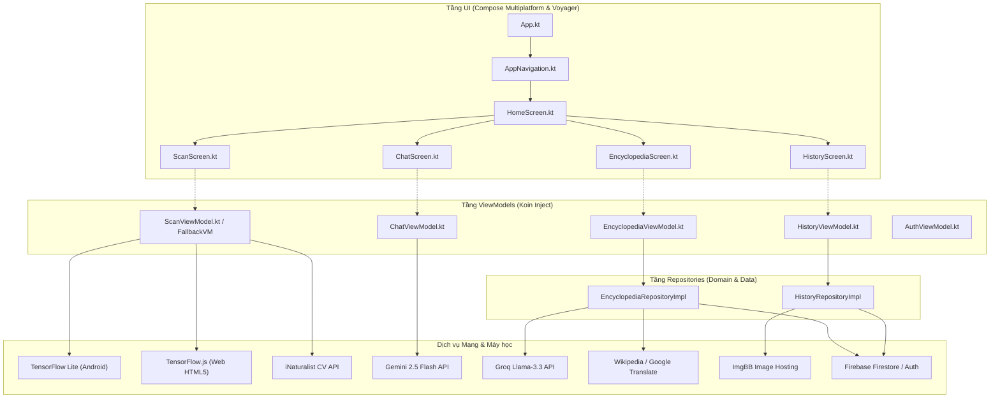

# 🐛 BugScanner - Ứng dụng Nhận diện & Tra cứu Sâu bệnh Nông nghiệp Đa nền tảng

[](https://kotlinlang.org/)
[](https://github.com/JetBrains/compose-multiplatform)
[](https://www.tensorflow.org/)
[](https://firebase.google.com/)
[](https://deepmind.google/technologies/gemini/)

**BugScanner** là ứng dụng đa nền tảng (Android, iOS, Web, Desktop) được phát triển nhằm mục đích hỗ trợ người nông dân và các nhà nghiên cứu sinh học phát hiện, nhận diện và tìm kiếm các biện pháp xử lý đối với hơn 100 loài sâu bệnh phá hoại cây trồng. 

Dự án tích hợp mô hình học máy cục bộ (On-device Machine Learning) cùng hệ thống trí tuệ nhân tạo tạo sinh (Generative AI) để mang lại khả năng chẩn đoán nhanh chóng, chính xác và trực quan ngay trên thiết bị của người dùng.

---

## 🌟 Tính Năng Nổi Bật

| Tính năng | Chi tiết kỹ thuật |
| :--- | :--- |
| **🔍 Nhận diện sâu bệnh cục bộ (On-device)** | Sử dụng mô hình **YOLOv8** (phiên bản tối ưu hóa IP102 dataset) chạy trực tiếp bằng **TensorFlow Lite** trên Android và **TensorFlow.js (WebGL GPU)** trên Web. Hỗ trợ quét qua camera thời gian thực hoặc import ảnh tĩnh. |
| **☁️ Chẩn đoán dự phòng (iNaturalist Fallback)** | Khi mô hình cục bộ cần độ chính xác cao hơn, hệ thống tự động kết nối đến **iNaturalist Computer Vision API** để định danh sinh học nâng cao và tra cứu sơ đồ phân loại học. |
| **🤖 Trợ lý Nông nghiệp AI** | Tích hợp chatbot thông minh hỗ trợ bởi **Google Gemini 2.5 Flash**. Người dùng có thể hỏi đáp trực tiếp bằng văn bản hoặc gửi kèm hình ảnh chụp sâu bệnh để được tư vấn cách phòng trừ. |
| **📖 Bách khoa toàn thư Sâu bệnh** | Danh mục gồm **102 loài sinh vật** gây hại phổ biến. Nội dung nông nghiệp chuyên sâu tiếng Việt được tổng hợp động thông qua mô hình **Llama 3.3 (Groq API)** ở định dạng JSON chuẩn hóa, kết hợp **Wikipedia API** và dịch thuật tự động Google Translate. |
| **⏳ Đồng bộ Lịch sử (Cloud Sync)** | Quản lý lịch sử quét đồng bộ đám mây bằng **Firebase Firestore**. Ảnh chụp được tự động tải lên dịch vụ lưu trữ **ImgBB** thông qua mã hóa Base64 và Ktor Client. |
| **📱 Giao diện Adaptive (Responsive)** | Phát triển hoàn toàn trên **Compose Multiplatform** kết hợp `WindowSizeClass` của Material 3, mang lại giao diện mượt mà thích ứng từ điện thoại, máy tính bảng cho đến trình duyệt web và máy tính để bàn. |

---

## 🛠️ Kiến Trúc Hệ Thống & Sơ Đồ Khối

Ứng dụng tuân thủ mô hình thiết kế **MVVM (Model-View-ViewModel)** kết hợp cấu trúc **Clean Architecture** thu nhỏ để dễ dàng chia sẻ mã nguồn giữa các nền tảng:



---

## 📂 Cấu Trúc Mã Nguồn

```ini
bug-scanner/src/
├── composeApp/                       # Mã nguồn chia sẻ Compose Multiplatform
│   ├── src/
│   │   ├── commonMain/kotlin/        # Logic nghiệp vụ chung (KMP)
│   │   │   └── hcmus/bugscanner/
│   │   │       ├── core/di/          # Dependency Injection (Koin AppModule)
│   │   │       ├── core/utils/       # Tiện ích chia sẻ (ShareManager, TimeUtils)
│   │   │       ├── domain/model/     # Định nghĩa các Data Model (ScanHistory, BugInfo)
│   │   │       ├── domain/repository/# Cổng giao tiếp dữ liệu (Interface)
│   │   │       ├── data/repository/  # Thực thi nghiệp vụ dữ liệu (Firestore, ImgBB)
│   │   │       ├── data/remote/      # API Clients (Ktor: Gemini, Groq, iNat, Wiki)
│   │   │       ├── ml/               # YOLO Constants & cấu hình nhãn IP102
│   │   │       └── ui/               # Màn hình UI (Scan, History, Encyclopedia, Chat, Navigation)
│   │   ├── androidMain/              # Code đặc thù Android (CameraX, YOLO TFLite)
│   │   ├── iosMain/                  # Cấu hình khởi chạy trên iOS (MainViewController)
│   │   ├── jsMain/                   # Code đặc thù Kotlin/JS
│   │   ├── wasmJsMain/               # Cấu hình WasmJs (nếu có)
│   │   └── webMain/                  # Logic chạy Web HTML5 (TF.js, WebCamera, ImagePicker)
│   │       └── resources/            # Tài nguyên Web (yolo_helper.js, best_web_model/)
│   └── build.gradle.kts              # Cấu hình Gradle của module Compose App
├── iosApp/                           # Entry point của ứng dụng iOS (SwiftUI project)
├── functions/                        # Thư mục Firebase Cloud Functions
├── firebase.json                     # Cấu hình triển khai Firebase (Hosting)
└── settings.gradle.kts               # Cấu hình quản lý Gradle project
```

---

## ⚙️ Hướng Dẫn Cài Đặt & Cấu Hình

### 1. Yêu cầu hệ thống
* **Java Development Kit (JDK):** Phiên bản 17 trở lên.
* **Android SDK:** Cài đặt thông qua Android Studio (để chạy trên Android).
* **Xcode:** Yêu cầu hệ điều hành macOS (để biên dịch và chạy trên iOS).
* **NodeJS / Package Manager:** Yarn hoặc NPM (để build/deploy Web target).

### 2. Thiết lập biến môi trường (API Keys)
Tạo tệp `local.properties` tại thư mục gốc của dự án và điền các khóa API bảo mật:

```properties
# Google Gemini API Key (Dành cho Trợ lý ảo AI)
GEMINI_API_KEY=AIzaSy...

# Groq API Key (Dành cho Llama 3.3 dịch và tóm tắt thông tin nông nghiệp)
GROQ_API_KEY=gsk_...

# ImgBB API Key (Dành cho dịch vụ upload hình ảnh lịch sử quét)
IMGBB_API_KEY=your_imgbb_key_here

# iNaturalist API Token (Tùy chọn, dùng để tăng hạn mức gọi API định danh)
INATURALIST_API_TOKEN=your_inaturalist_token_here
```

---

## 🚀 Hướng Dẫn Chạy Dự Án (Build & Run)

Ứng dụng có thể được chạy từ terminal thông qua công cụ Gradle Wrapper (`gradlew`):

### 📱 Nền tảng Android
Biên dịch và chạy ứng dụng trên thiết bị Android hoặc Emulator:
```bash
./gradlew :composeApp:installDebug
```

### 🍏 Nền tảng iOS
Mở thư mục `iosApp/` bằng phần mềm **Xcode** và chọn chạy trên Simulator/Thiết bị vật lý, hoặc chạy trực tiếp bằng dòng lệnh:
```bash
./gradlew :composeApp:iosDeploy
```

### 💻 Nền tảng Desktop (JVM)
Chạy ứng dụng dưới dạng cửa sổ Desktop độc lập (Windows/macOS/Linux):
```bash
./gradlew :composeApp:run
```

### 🌐 Nền tảng Web (HTML5)
* Chạy môi trường phát triển (Development Server) có hỗ trợ Hot-Reload:
  ```bash
  ./gradlew :composeApp:jsBrowserDevelopmentRun
  ```
* Sau khi khởi chạy, truy cập đường dẫn mặc định: `http://localhost:8080`

* **Triển khai Web lên Firebase Hosting:**
  1. Build bản phát hành tối ưu (Production Build):
     ```bash
     ./gradlew :composeApp:jsBrowserProductionLibraryDistribution
     ```
  2. Deploy lên Firebase (Yêu cầu cài đặt `firebase-tools` trước):
     ```bash
     firebase deploy --only hosting
     ```

---

## 🧪 Tập Dữ Liệu & Mô Hình Nhận Diện
Mô hình YOLOv8 sử dụng trong dự án được tinh chỉnh và huấn luyện trên tập dữ liệu nông nghiệp **IP102** bao gồm 102 lớp sâu hại phổ biến (như Rầy nâu, Sâu cuốn lá, Muỗi hành, Nhện đỏ, v.v.).

* **Android:** Sử dụng file `model.tflite` đặt trong thư mục `assets` với kích thước ảnh đầu vào là $896 \times 896$ pixels, hỗ trợ tăng tốc phần cứng thông qua `GpuDelegate` hoặc đa luồng CPU (4 threads).
* **Web:** Tải mô hình GraphModel của TensorFlow.js (`best_web_model/model.json`) và tận dụng WebGL/WebGPU để suy luận trực tiếp trên trình duyệt, quản lý bộ nhớ thông qua cơ chế `tf.tidy()` để chống rò rỉ VRAM.

---

## 📝 Bản Quyền & Giấy Phép
Dự án được xây dựng và phát triển dưới dạng mã nguồn mở phục vụ học tập và nghiên cứu khoa học tại trường **Đại học Khoa học Tự nhiên, ĐHQG-HCM (HCMUS)**.

*Vui lòng tuân thủ điều khoản sử dụng các API bên thứ ba (Google Gemini, Groq, iNaturalist, Wikipedia, ImgBB) khi phân phối thương mại.*